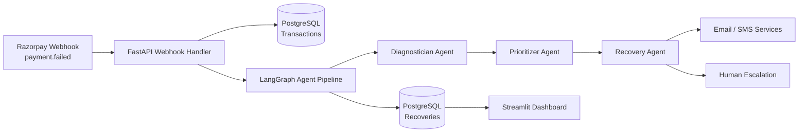

# 💳 Revive AI — Autonomous Revenue Recovery Agent

[]()
[]()
[]()
[]()
[]()
[]()

> **Revive AI** recovers revenue that businesses lose to failed payments — automatically, using a multi-agent AI system that diagnoses *why* a payment failed and executes the right recovery workflow for it.

---

## 📌 Problem Statement

Payment failures are one of the largest silent revenue leaks for subscription and e-commerce businesses in India.

| Metric | Reality |
|---|---|
| Avg. involuntary churn from failed payments | 20–30% of total churn |
| Typical recovery approach today | Manual follow-up or a single generic retry email |
| Revenue lost annually (Indian SaaS/D2C, est.) | ₹100s of crores |

Most businesses treat every failed payment the same way — one retry, one email — regardless of *why* it failed. A card that's expired needs a different recovery path than a card that had insufficient funds at the time of billing.

## 💡 Solution

Revive AI listens to payment gateway webhooks (Razorpay) in real time, classifies the failure with an LLM-backed diagnostic agent, prioritizes the transaction by recoverable MRR, and runs a **bounded, auditable recovery workflow** (smart retry → email → SMS → human escalation) — instead of a one-size-fits-all retry.

## ✨ Key Features

- 🔍 **Diagnostic Agent** — classifies failure reason (hard decline, soft decline, expired card, insufficient funds) using an LLM with a structured output schema
- 📊 **Prioritizer Agent** — scores each failure by recoverable MRR and recovery probability
- 🔁 **Recovery Agent** — executes a **bounded** workflow (max 3 attempts) across retry → email → SMS, then escalates to a human
- 🧾 **Full Audit Trail** — every agent decision is logged with a correlation ID
- 🛡️ **Guardrails** — webhook signature verification, Pydantic-validated LLM outputs, human-in-the-loop for high-value transactions (>₹10,000)
- 📈 **Live Dashboard** — recovery rate, at-risk MRR, and recovered revenue in real time

## 🏗️ Architecture (High Level)



Full breakdown of every component, the agent state machine, and the database schema lives in [`ARCHITECTURE.md`](./ARCHITECTURE.md).

## 🧰 Tech Stack

| Layer | Technology | Why |
|---|---|---|
| API | FastAPI | Async-first, native Pydantic validation |
| Agent Orchestration | LangGraph | Stateful graph execution + checkpointing |
| Database | PostgreSQL (Supabase) | Relational integrity for financial data |
| Notifications | Postmark (email), Twilio (SMS) | Reliable transactional delivery |
| Dashboard | Streamlit | Fast, functional internal tooling |
| Deployment | Docker + docker-compose | Reproducible local & prod parity |
| LLM | GPT-4o (configurable) | Structured classification with high accuracy |

## 📁 Project Structure

```
revive-ai/
├── backend/
│   ├── app/
│   │   ├── main.py            # FastAPI entry point
│   │   ├── config.py          # Settings & environment variables
│   │   ├── database.py        # PostgreSQL connection
│   │   ├── models.py          # SQLAlchemy models
│   │   ├── schemas.py         # Pydantic request/response schemas
│   │   ├── webhooks/          # Razorpay / Stripe webhook handlers
│   │   ├── agents/            # LangGraph state machine, nodes, tools
│   │   ├── services/          # Email, SMS, payment gateway clients
│   │   └── api/                # Dashboard API + metrics endpoints
│   ├── tests/                 # pytest suite
│   ├── Dockerfile
│   └── .env.example
├── frontend/dashboard/         # Streamlit app
├── docs/                       # ARCHITECTURE.md, API.md, DEPLOYMENT.md
├── docker-compose.yml
└── README.md
```

## 🚀 Getting Started

```bash
# 1. Clone
git clone https://github.com/<your-username>/revive-ai.git
cd revive-ai

# 2. Configure environment
cp backend/.env.example backend/.env
# fill in RAZORPAY_WEBHOOK_SECRET, DATABASE_URL, OPENAI_API_KEY, POSTMARK_TOKEN, TWILIO_SID etc.

# 3. Run everything locally
docker-compose up --build

# 4. Verify the API is up
curl http://localhost:8000/health

# 5. Launch the dashboard
streamlit run frontend/dashboard/app.py
```

## 📡 API Overview

| Endpoint | Method | Purpose |
|---|---|---|
| `/webhooks/razorpay` | POST | Receives `payment.failed` events |
| `/api/transactions` | GET | List failed/recovered transactions |
| `/api/recoveries` | GET | List recovery attempts and status |
| `/api/metrics` | GET | Recovery rate, MRR at risk, MRR saved |

Full request/response schemas, auth, and error codes: [`API.md`](./API.md).

## 📊 Impact Metrics (Target for Demo)

| Metric | Baseline (manual) | With Revive AI |
|---|---|---|
| Recovery rate | ~8–12% | 30–40% (target) |
| Time to first recovery action | Hours (manual) | < 60 seconds |
| Human effort per failed payment | Manual review | Only escalated cases |

## 🗺️ Roadmap

- [ ] Stripe webhook support (multi-gateway)
- [ ] Adaptive retry timing based on customer bank/issuer patterns
- [ ] WhatsApp Business API as a recovery channel
- [ ] Self-serve merchant onboarding

## 🧪 Testing

```bash
cd backend
pytest tests/ -v
```

## 📄 License

MIT — see `LICENSE`.

## 👤 Team / Contact

Built for [Buildathon Name] — submission deadline **September 4**.
Maintainer: `<your name>` · GitHub: `<your github>`
